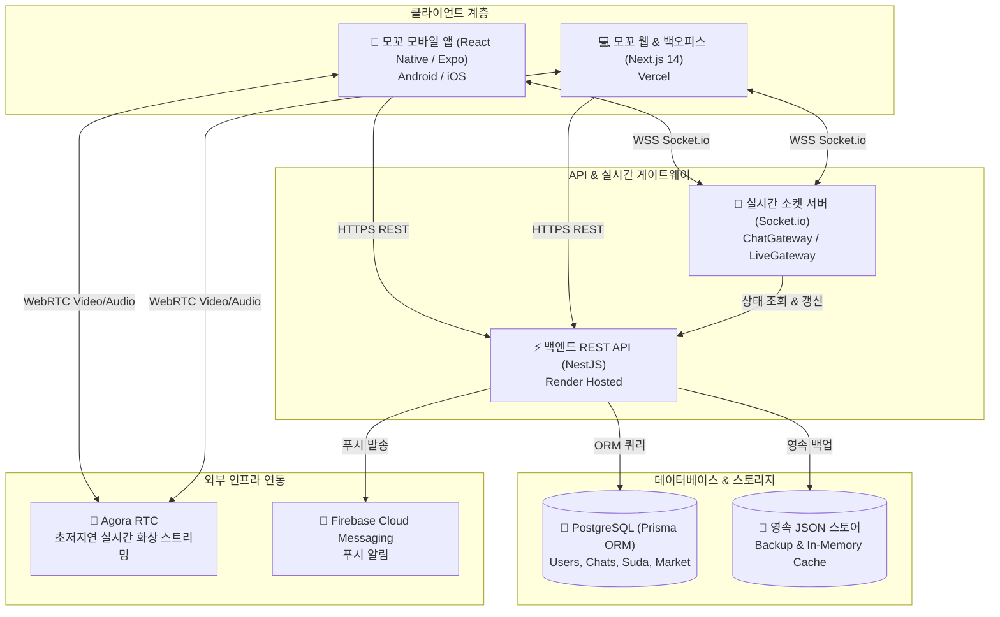
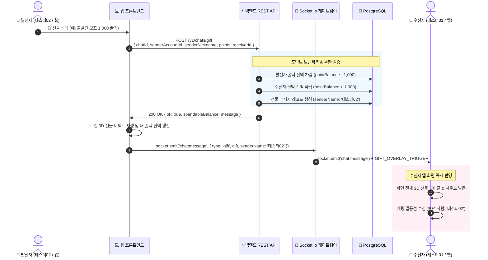
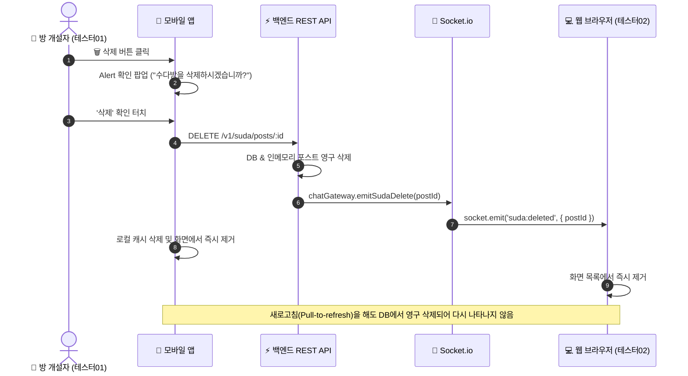

# 모꼬 (MOCCO) 시스템 아키텍처 및 데이터 흐름

---

## 1. 전체 시스템 아키텍처

```mermaid
flowchart TD
    subgraph Clients["클라이언트 계층"]
        App["📱 모꼬 모바일 앱 (React Native / Expo)<br/>Android / iOS"]
        Web["💻 모꼬 웹 & 백오피스 (Next.js 14)<br/>Vercel"]
    end

    subgraph Gateway["API & 실시간 게이트웨이"]
        API["⚡ 백엔드 REST API (NestJS)<br/>Render Hosted"]
        WS["🔄 실시간 소켓 서버 (Socket.io)<br/>ChatGateway / LiveGateway"]
    end

    subgraph Storage["데이터베이스 & 스토리지"]
        DB[("🐘 PostgreSQL (Prisma ORM)<br/>Users, Chats, Suda, Market")]
        Disk[("💾 영속 JSON 스토어<br/>Backup & In-Memory Cache")]
    end

    subgraph ThirdParty["외부 인프라 연동"]
        Agora["🎥 Agora RTC<br/>초저지연 실시간 화상 스트리밍"]
        FCM["🔔 Firebase Cloud Messaging<br/>푸시 알림"]
    end

    App -->|HTTPS REST| API
    App <-->|WSS Socket.io| WS
    Web -->|HTTPS REST| API
    Web <-->|WSS Socket.io| WS

    App <-->|WebRTC Video/Audio| Agora
    Web <-->|WebRTC Video/Audio| Agora

    API -->|ORM 쿼리| DB
    API -->|영속 백업| Disk
    WS -->|상태 조회 & 갱신| API
    API -->|푸시 발송| FCM
```

---

## 2. 1:1 채팅 및 3D 선물 전송 데이터 흐름

```mermaid
sequenceDiagram
    autonumber
    actor Sender as 🧑 발신자 (테스터02 / 웹)
    participant Client as 💻 웹 프론트엔드
    participant API as ⚡ 백엔드 REST API
    participant WS as 🔄 Socket.io 게이트웨이
    participant DB as 🐘 PostgreSQL
    actor Receiver as 📱 수신자 (테스터01 / 앱)

    Sender->>Client: 🎁 선물 선택 (예: 볼빨간 모꼬 1,000 꿀떡)
    Client->>API: POST /v1/chats/gift<br/>{ chatId, senderAccountId, senderNickname, points, receiverId }
    
    rect rgb(240, 248, 255)
        Note over API,DB: 포인트 트랜잭션 & 권한 검증
        API->>DB: 발신자 꿀떡 잔액 차감 (pointBalance - 1,000)
        API->>DB: 수신자 꿀떡 잔액 적립 (pointBalance + 1,000)
        API->>DB: 선물 메시지 레코드 생성 (senderName: '테스터02')
    end

    API-->>Client: 200 OK { ok: true, spendableBalance, message }
    Client->>Client: 로컬 3D 선물 이펙트 재생 및 내 꿀떡 잔액 갱신

    Client->>WS: socket.emit('chat:message', { type: 'gift', gift, senderName: '테스터02' })
    WS->>Receiver: socket.emit('chat:message') + GIFT_OVERLAY_TRIGGER
    
    rect rgb(255, 240, 245)
        Note over Receiver: 수신자 앱 화면 즉시 반영
        Receiver->>Receiver: 화면 전체 3D 선물 파티클 & 사운드 발동
        Receiver->>Receiver: 채팅 말풍선 수신 (보낸 사람: '테스터02')
    end
```

---

## 3. 전체수다(Suda) 개설 및 삭제 동기화 흐름

```mermaid
sequenceDiagram
    autonumber
    actor User as 👤 방 개설자 (테스터01)
    participant App as 📱 모바일 앱
    participant API as ⚡ 백엔드 REST API
    participant WS as 🔄 Socket.io
    participant Web as 💻 웹 브라우저 (테스터02)

    User->>App: 🗑️ 삭제 버튼 클릭
    App->>App: Alert 확인 팝업 ("수다방을 삭제하시겠습니까?")
    User->>App: '삭제' 확인 터치
    
    App->>API: DELETE /v1/suda/posts/:id
    API->>API: DB & 인메모리 포스트 영구 삭제
    API->>WS: chatGateway.emitSudaDelete(postId)
    
    WS->>Web: socket.emit('suda:deleted', { postId })
    App->>App: 로컬 캐시 삭제 및 화면에서 즉시 제거
    Web->>Web: 화면 목록에서 즉시 제거
    
    Note over App,Web: 새로고침(Pull-to-refresh)을 해도 DB에서 영구 삭제되어 다시 나타나지 않음
```

